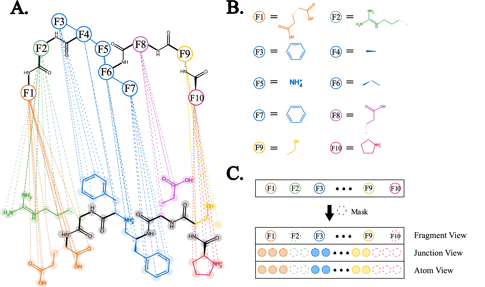
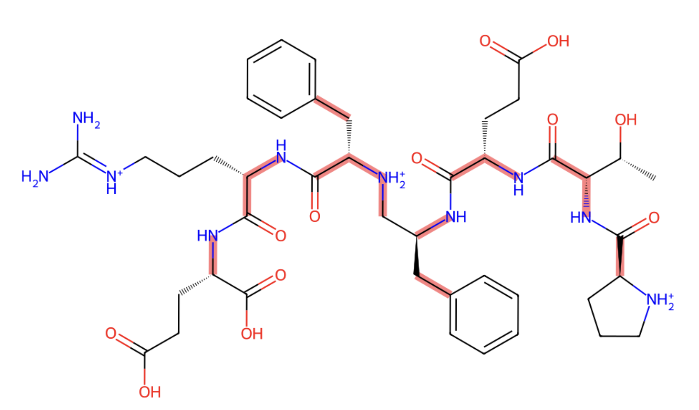

- [PepLand](#pepland)
  - [Introduction](#introduction)
    - [Pepland Architecture](#pepland-architecture)
    - [Fragmentation Operator](#fragmentation-operator)
    - [Multi-view Heterogeneous Graph](#multi-view-heterogeneous-graph)
  - [Installation](#installation)
  - [Inference using pretrained PepLand](#inference-using-pretrained-pepland)
  - [Training](#training)
  - [AdaFrag](#adafrag)

# PepLand

This repository contains the code for the paper [PepLand: a large-scale pre-trained peptide representation model for a comprehensive landscape of both canonical and non-canonical amino acids](https://arxiv.org/abs/2311.04419).

## Introduction

Pre-existing models, such as the Evolutionary Scale Modeling (ESM) and ProteinBert, leverage amino acid sequences to learn and predict coevolutionary information embedded in protein sequences. These models have showcased noteworthy success in protein-related tasks, but their efficacy is compromised when dealing with **peptides**.Furthermore, a critical limitation observed in models such as ESM is their incapacity to effectively handle **non-canonical amino acids**, which are frequently used to enhance the pharmaceutical properties of peptides.There are some researchers who might use **models from the field of ligands(small molecules)** to extract the representation of peptides11, but our results also indicate that this is not a suitable approach.

We herein propose `PepLand`, a novel pre-training architecture for **representation and property analysis of peptides spanning both canonical and non-canonical amino acids**. In essence, PepLand leverages a comprehensive **multi-view heterogeneous graph neural network** tailored to unveil the subtle structural representations of peptides. Our model ingeniously amalgamates a multi-view heterogeneous graph that comprises both atom and fragment views, thus enabling a comprehensive representation of peptides a varying granular levels.

Empirical validations underscore PepLand's effectiveness across an array of **peptide property predictions**, encompassing **protein-protein interactions**, **permeability**, **solubility**, and **synthesizability**. The rigorous evaluation confirms PepLand's unparalleled capability in capturing salient synthetic peptide features, thereby laying a robust foundation for transformative advances in peptide-centric research domains.

### Pepland Architecture


The overall workflow of proposed PepLand framework. (a) Two-stage training approach. PepLand will first be trained on peptide sequences containing only canonical amino acids, and then futher trained on peptide sequences containing non-canonical amino acids. After this, PepLand can be finetuned for downstream property prediction task. (b) PepLand uses a multi-view heterogeneous graph network to represent the molecular graph of peptides. Fragments of various granularities will be randomly masked for self-supervised pretraining.

### Fragmentation Operator

<p align="center">
  
</p>

Illustrations of the Amiibo and AdaFrag fragmentation operator. Amiibo operator breaks the molecules while preserving amino bonds, and continues further fragmenting large side chains using the BRICS algorithm (Degen, et al., 2008). (a) A example molecular graph of a peptide containing non-canonical amino acids, with each side chain highlighted in different colours. The Amiibo operator breaks all cleavaged bonds, preserving all amino bonds and cut the molecule into multiple fragments. (b) Output of the Amino Operator. It can be observed that, in addition to some peptide bonds and common side chains, there is a larger fragment covered by blue colour. (c) The Adafrag operator will further use the BRICS algorithm to break this large fragment.

### Multi-view Heterogeneous Graph



The multi-view feature representation framework of PepLand. (a) A peptide molecule can have multiple representations of views. The top F1-F10 in the figure represent fragment views, and the bottom represents atom-level views. Both atoms and fragments will learn a junction view representation. Homogeneous edges are formed within atoms and fragments. Heterogeneous edges are formed between atoms and fragments, as each fragment in the figure is connected to a specific subgraph structure below. (b) Molecular graph structures of F1-F10. They are connected by amino bonds. (c) Each representation of views will be randomly masked for self-supervised learning.

## Installation

```shell
conda env create -f environment.yaml
conda activate multiview
```

## Inference using pretrained PepLand

- Modify `configs/inference.yaml` to configure the inference

```
cd inference 
python inference_pepland.py
```

## Training

1. Modify `configs/pretrain_masking.yaml` to configure the training

- Masking Method

```bash
train.mask_pharm = True # random fragment masking
train.mask_rate = 0.8 # masking rate (random atom masking and random fragment masking)
train.mask_amino = 0.3 # or False, masking atoms of the same amino acid.
train.mask_pep = 0.8 # or False, masking atoms of side chains 
```

- Training Step1: Pretraining on canonical amino acids

```bash
train.dataset = pretrained
train.model = PharmHGT
```

- Training Step2: Pretraining on non-canonical amino acids

```bash
train.dataset = further_training
train.model = fine-tune
```

- Message Passing Architecture

```bash
train.model = PharmHGT # HGT
```

2. Run training script

```bash
python pretrain_masking.py
```

## AdaFrag

1. Navigate to the tokenizer directory

```
cd tokenizer
```

2. Run the AdaFrag script

```bash
python pep2fragments.py
```

3. Examples:

```python
import os
import sys

from rdkit import Chem
from rdkit.Chem import AllChem
from rdkit.Chem import Draw
from pep2fragments import get_cut_bond_idx


smi = 'OC(=O)CC[C@@H](C(=O)N[C@@H](Cc1ccccc1)C[NH2+][C@H](C(=O)N[C@H](C(=O)N[C@H](C(=O)O)CCC(=O)O)CCC[NH+]=C(N)N)Cc1ccccc1)NC(=O)[C@H]([C@H](O)C)NC(=O)[C@H]1[NH2+]CCC1'
mol = Chem.MolFromSmiles(smi)

# side_chain_cut = True: AdaFrag 
# side_chain_cut = False: Amiibo

break_bonds, break_bonds_atoms = get_cut_bond_idx(mol, side_chain_cut = True)
highlight_bonds = []
for bond in mol.GetBonds():
    if bond.GetIdx() in break_bonds:
        highlight_bonds.append(bond.GetIdx())

# cleavaged bonds are highlighted in red.
Draw.MolToImage(mol, highlightBonds=highlight_bonds, size = (1000, 1000))
```


